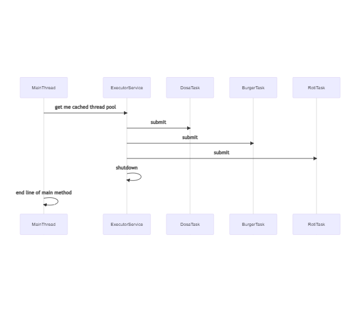
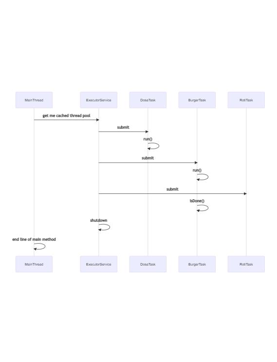
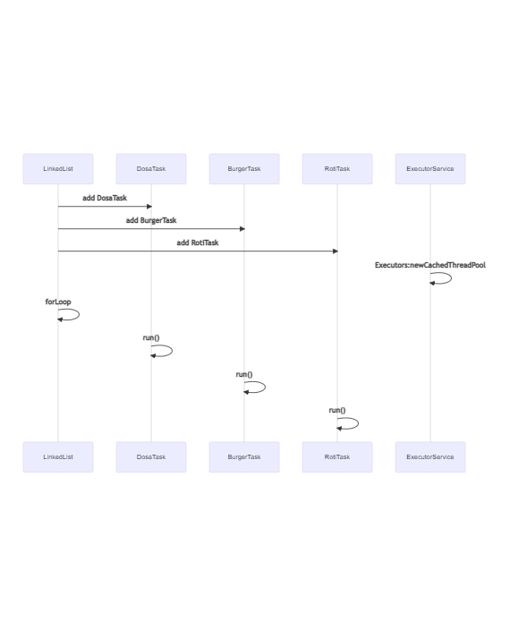
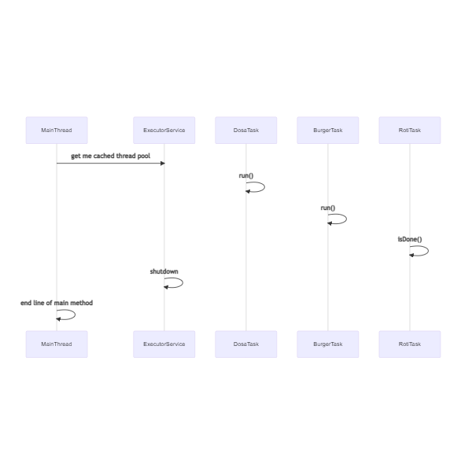

# java_8_thread_future_runnable_task
This example explains task execution in order and without order. It uses java.util.concurrent.Future to achieve it. ExecuterService is used as handle to thread-pool

## Random task execution
All tasks has been submitted to ExecutorService in one shot, and all started in one shot.

## Ordered task execution, but failed due to submission in one shot.

## Ordered task execution, future.isDone checks completion of first task then next task is added by executor.submit(task).

## Ordered task execution, all task has been added to Linkedlist and with iteration of list , future.isDone checks completion of first task then next task is added by executor.submit(task).

